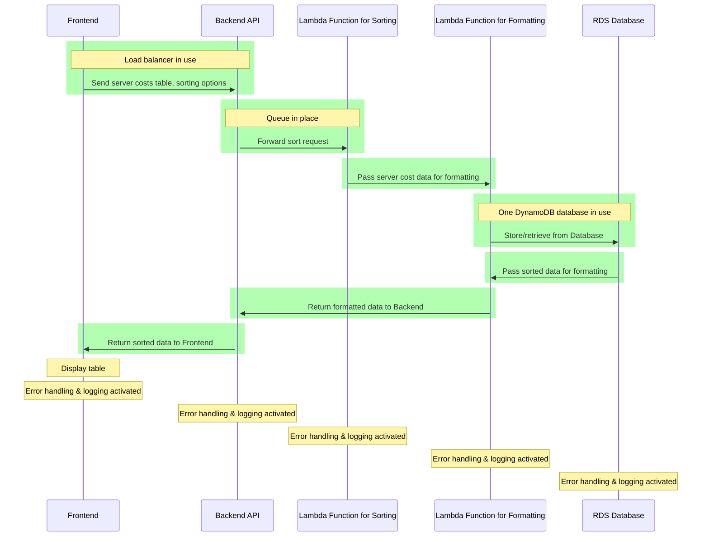

# Requirements Document

## Project Name

Web Application with Nx, EKS, Lambda, RDS, and S3

## Project Goal

To build and deploy a scalable, reliable, and secure web application using Nx, EKS, Lambda, RDS, and S3, showcasing advanced skills in server-side sorting with AWS Lambda and Python using FastAPI.

## Functional Requirements

- The web application shall be built using the Nx framework.
- The web application shall be deployed to an EKS cluster.
- The web application shall use a Lambda function for server-side sorting of the "Server Costs" table.
- The Lambda function shall:
    - Fetch server cost data from the RDS database.
    - Perform sorting based on user input (name or total cost to date).
    - Format dates in mm/yy format and costs in US currency.
    - Return the sorted data to the frontend.
- The web application shall display the sorted "Server Costs" table with the following columns:
    - Name
    - Provider
    - Monthly Cost
    - Start Date
    - Months Running
    - Total Cost to Date
- The web application shall also display an overall sum of all server costs to date below the table.
- Everything on the page shall be labeled and styled clearly and accessibly.

## Constraints

- The web application must be deployed to the AWS cloud.
- The web application must use the Nx framework.
- The server-side sorting logic must be implemented in a Python Lambda function with FastAPI.

## Acceptance Criteria

- The web application shall be successfully deployed to an EKS cluster.
- The web application shall be able to handle increasing traffic.
- The web application shall be available 24/7.
- The web application shall protect user data.
- The Lambda function shall accurately sort the "Server Costs" table based on user input.
- All dates and costs shall be displayed in the specified formats.
- The page design shall be clear and user-friendly.

## Technical Considerations

- **Lambda Limits:** Monitor the Lambda function's execution time and memory usage to ensure efficient sorting operations.
- **FastAPI in Lambda:** Employ best practices for using FastAPI within Lambda, considering potential limitations.
- **Database Interactions:** Establish secure and efficient communication between the Lambda function and the RDS database for data retrieval.
- **Data Formatting:** Use appropriate libraries or techniques to format dates and currency within the Lambda function.

##  Architecture Design

2. Lambda Function Development
3. Frontend Integration
4. Testing and Deployment
